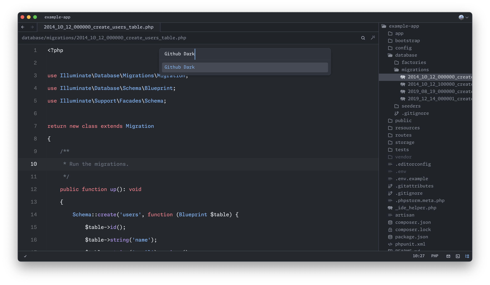

# GitHub's Zed themes

Project inspired on [GitHub's VS Code theme](https://github.com/primer/github-vscode-theme).




## Installation

Download [github-theme.json](https://raw.githubusercontent.com/PyaeSoneAungRgn/github-zed-theme/main/github-theme.json)

Copy `github-theme.json` file to `~/.config/zed/themes` folder
```bash
cp github-theme.json ~/.config/zed/themes/github-theme.json
```

## Activate Theme

1. Open `Command Palette`
2. Select `theme selector: toggle`
3. Search `Github Light` or `Github Dark`

## Contributing

Feel free to fork, make changes, and submit a pull request.
