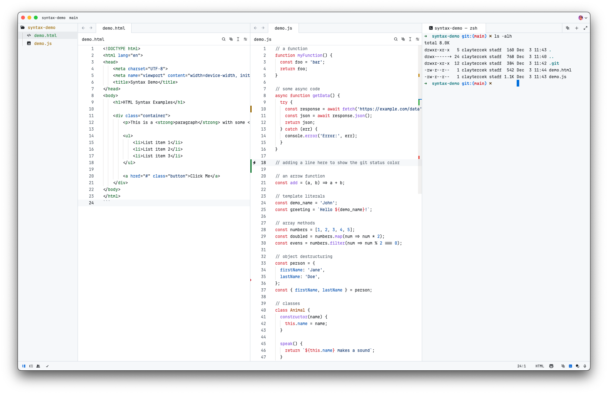

# GitHub Zed Themes

Project inspired on [GitHub's VS Code theme](https://github.com/primer/github-vscode-theme). Generated from [Primer's Primitives](https://primer.style/primitives/).

### Light



### Light High Contrast


### Dark


### Dark Dimmed


### Dark High Contrast


## Installation

1. Open `Command Palette`
2. Select `zed: extensions`
3. Search `GitHub Theme`

## Activate Theme

1. Open `Command Palette`
2. Select `theme selector: toggle`
3. Search `GitHub Light` or `GitHub Dark`

## Contributing

Feel free to fork, make changes, and submit a pull request.

## Development

```bash
npm install
npm run dev
```

## Publishing new versions

1. Update the version in `extension.toml`
2. Run `npm run build`
3. Commit and push your changes (make sure to push the built files in `themes/` as well)
4. Follow the [Zed publishing docs](https://zed.dev/docs/extensions/developing-extensions#updating-an-extension) to publish the extension